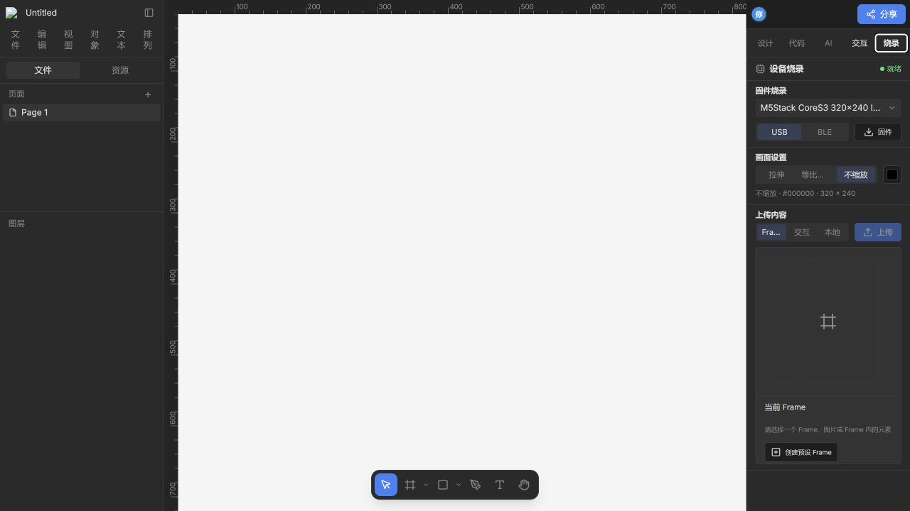

# OP Embedded Studio

嵌入式 UI 设计、交互原型、固件烧录与无线传输平台。它将可视化设计画布与真实 ESP32 显示设备连接起来，让设计内容可以直接预览、烘焙、传输和烧录。

An embedded UI design, interaction prototyping, firmware flashing, and wireless content transfer platform. OP Embedded Studio connects a visual design canvas to real ESP32 display hardware so that interfaces can be previewed, baked, transferred, and flashed directly to a device.

> **项目来源与致谢：** 本项目最初基于 [OpenPencil](https://github.com/open-pencil/open-pencil) 开发。感谢 OpenPencil 原作者与社区提供优秀的开源设计编辑器基础，包括画布、文档格式、渲染、排版、AI、MCP 和 CLI 等能力。由于嵌入式设备、固件和传输链路相关改动较大，OP Embedded Studio 目前作为独立衍生项目维护，与 OpenPencil 官方项目不存在隶属关系。
>
> **Origin and acknowledgements:** This project was originally built on top of [OpenPencil](https://github.com/open-pencil/open-pencil). We sincerely thank the OpenPencil authors and community for the open-source editor foundation, including its canvas, document model, rendering, typography, AI, MCP, and CLI capabilities. Because OP Embedded Studio has diverged substantially around embedded hardware, firmware, and transfer workflows, it is now maintained as an independent derivative project and is not affiliated with or endorsed by the official OpenPencil project.

## 核心能力

- 在可视化画布中设计面向真实嵌入式屏幕的 Frame，也可以直接使用独立图片节点
- 在同一个 AI 对话中结合文字和参考图创建或调整设备界面，并继续准备单画面烧录、手动浏览、幻灯片和自定义事件交互
- 将 Frame 或图片按目标分辨率烘焙为 RGB565 设备内容
- 在烧录前预览圆屏裁切、画面适配和多画面交互效果
- USB 自动检查设备固件；固件不兼容时自动更新，再继续传输当前内容
- 默认提供 USB 与 BLE 内容传输；Wi-Fi 和 Wi-Fi 实时镜像仍保留在源码中，属于实验性能力，默认界面不展示
- 支持本地单图、PNG 序列，以及独立 Android BLE 图片上传器
- 交互栏可导入“状态级”PNG 序列：每个状态独立播放动画，并能由屏幕/BOOT 事件即时切换到另一段动画。该模式使用独立固件，不会改变普通烧录页的内容路径。
- 保留 OpenPencil 的设计编辑、文档格式、MCP、CLI 和设计转代码基础能力

<p align="center">
  
</p>

<p align="center">
  
</p>

## What OP Embedded Studio Does

- **Design with visual AI context** — create or refine an embedded screen from text and pasted reference images.
- **Prepare device deployments with AI** — turn selected Frames or images into a single-screen deployment, manual gallery, slideshow, or custom event graph.
- **Preview before touching hardware** — inspect the target resolution, circular viewport, image placement, and interaction behavior from the Interaction panel or an AI confirmation card.
- **Deploy through one USB flow** — confirm the deployment and select the device once; Studio checks firmware compatibility, updates the base firmware when required, reconnects, and transfers the content.
- **Keep content updates fast** — compatible devices receive Frame, interaction, or sequence content without reflashing the application firmware.
- **Transfer over BLE** — use Web Bluetooth in a Chromium browser or the companion Android uploader.
- **Experimental wireless paths** — Wi-Fi and Wi-Fi realtime mirror remain available for contributors who clone the repository and enable the source-level debug path; they are not part of the default product workflow.

## 从设计到设备

1. 在画布中创建 Frame，或拖入一张或多张图片。
2. 在“烧录”页签选择目标屏幕，并设置拉伸、等比缩放或不缩放。
3. 直接烧录单画面，或在交互栏 / AI 中创建多画面交互。
4. 在设备模拟器中检查目标比例、圆屏裁切、背景补边和事件跳转。
5. 确认烧录并选择 USB 设备。Studio 会检查固件兼容性，然后自动更新固件或直接传输内容。

AI 的“准备”和“预览”只生成主机侧内容，不会直接操作硬件；只有用户在确认卡片中执行烧录时，才会请求 USB 设备权限。

## AI 工作流

### 统一 AI 助手

- 选中目标 Frame 后描述需要创建或修改的界面
- 可以粘贴或拖入参考图片，让支持视觉输入的模型结合当前画布进行设计
- AI 修改仍写回可编辑画布，可以继续手动调整和撤销
- 设计完成后可以在同一段对话中继续准备烧录，无需切换模式或重新描述上下文
- 根据当前选中的 Frame 或图片准备单画面烧录
- 将多个画面组织成手动浏览、幻灯片或自定义事件交互
- 在确认卡片中调整画面适配和背景色，并查看设备效果
- 在卡片中直接打开交互预览，确认后再选择设备和烧录
- 错误卡片会区分设备选择、串口占用、固件不兼容和内容失效等原因，并给出对应恢复操作

完成、取消或被新方案替代的卡片会折叠为历史记录，避免连续烧录时占满对话区域。

## 交互与设备模拟器

| 模式     | 行为                                               | 典型用途                         |
| -------- | -------------------------------------------------- | -------------------------------- |
| 手动浏览 | 为“下一张”和“上一张”选择设备事件，可设置首尾循环   | 图片浏览、菜单翻页、界面方案对比 |
| 幻灯片   | 按指定间隔自动切换画面，可在模拟器中暂停和重新开始 | 展示、轮播、动态信息屏           |
| 自定义   | 为每个画面的触屏与 BOOT 事件设置目标画面           | 菜单、流程原型、设备状态机       |

当前支持触屏单击、双击、三击、长按，以及 BOOT 单击和长按事件。交互栏和 AI 烧录卡片共用同一个设备模拟器，模拟器会使用当前设备分辨率、圆屏范围、画面适配和背景色。

## 交互页更新

交互页现在将“状态关系”和“设备预览”分成两个可调节区域：上方专注于状态图，下方专注于实时预览，中间的分隔条可以手动调整高度。状态图不是烧录页的缩小版，而是一个只负责组织 Frame 状态和事件关系的轻量画布。

- **状态节点**：每个 Frame 或 PNG 序列状态显示为简洁的圆角矩形，初始状态使用标记区分。
- **端口连接**：悬停状态节点后，可从上、右、下、左四个端口拖出连接；只有真正落到目标端口时才会创建连接，落在节点正文或空白区域会取消。
- **正交连线**：连接使用带圆角的折线，并尽量从节点外侧绕行。相同事件、相反状态方向且端口严格互换时合并为双向箭头；条件不同或端口不同则保留独立连线。
- **画布操作**：中键拖动平移，滚轮平移，`Ctrl`/`⌘` 加滚轮缩放，触摸设备支持双指平移和缩放；按住 `Z` 划过连线可以删除对应交互。
- **底部配置**：选中连线或状态后，在状态图下方配置触发事件、目标状态、手动浏览顺序、幻灯片间隔和 PNG 序列播放参数。
- **实时预览**：预览使用目标屏幕的真实宽高比和可视区域，不把圆形屏幕压缩成跑道形；预览中的交互按钮只驱动当前状态机，不直接触发烧录。

The Interaction page now separates the state graph from the live device preview. The graph is a lightweight state editor: nodes represent Frames or PNG-sequence states, connections are created from exact ports, and transitions are configured in the bar below the graph. Orthogonal rounded routes stay outside nodes where possible; only transitions with the same event, reversed state direction, and swapped ports merge into a bidirectional arrow. Panning, zooming, touch pinch gestures, and `Z`-gesture line removal are handled inside the graph, while the preview keeps the target display aspect ratio and remains independent from flashing.

## 画面适配

| 模式     | 说明                                                         |
| -------- | ------------------------------------------------------------ |
| 拉伸     | 将源画面完整拉伸到目标分辨率，可能改变宽高比                 |
| 等比缩放 | 保持宽高比完整显示，空白区域使用所选背景色                   |
| 不缩放   | 保持源像素尺寸并居中，超出设备区域时居中裁切，不足时补背景色 |

画面适配统一用于 USB、BLE、AI 单画面烧录和 AI 交互烧录。Wi-Fi 与实时镜像沿用同一套编码规则，但属于默认不开放的实验性路径。烧录确认卡与设备模拟器显示的是相同适配规则下的结果。

## 传输模式

| 模式           | 默认状态 | 单画面 | 交互 | PNG 序列 | 说明                                                  |
| -------------- | -------- | -----: | ---: | -------: | ----------------------------------------------------- |
| USB            | 提供     |     ✅ |   ✅ |       ✅ | 自动检查 USB 模式固件，不兼容时更新后继续传输内容     |
| BLE            | 提供     |     ✅ |   ✅ |       ✅ | 支持浏览器 Web Bluetooth 与 Android BLE App           |
| Wi-Fi          | 实验性   |     — |    — |        — | 源码保留，默认界面不展示，需要自行启用并验证固件      |
| Wi-Fi 实时镜像 | 实验性   |     — |    — |        — | 源码保留，默认界面不展示，需要自行启用并验证固件      |

不同模式拥有独立的状态、固件入口和传输适配器。切换模式不会复用其他模式的临时内容或连接状态。

## 基本工作流

### USB

1. 选择目标设备和一个 Frame / 图片；多选画面时也可以直接创建交互。
2. 设置画面适配，并在“烧录”页签或 AI 确认卡中准备内容。
3. 点击确认并选择 USB 设备。
4. Studio 检查设备是否支持当前 USB 内容协议。兼容时直接传输内容；不兼容时自动更新基础固件、等待设备重新连接，再继续传输内容。

正常使用不需要先进入单独的“初始化”步骤。只有设备维护、切换无线模式或底层固件开发时，才需要主动使用固件初始化入口。

### BLE

1. 选择支持 BLE 的内置设备方案。
2. 在浏览器中授予 Web Bluetooth 权限，或使用 Android BLE 上传器。
3. 选择单 Frame、交互状态机或 PNG 序列内容。
4. 上传后等待设备返回完成状态，再开始下一次传输。

### Wi-Fi 与实时镜像（实验性）

这两条链路不属于默认产品体验，也不在发布版界面中暴露。对底层固件、网络传输或实时镜像感兴趣的开发者可以 clone 仓库后自行启用调试路径；当前不承诺稳定性，也不提供常规用户支持。

## 当前重点适配设备

### Waveshare ESP32-S3-Touch-AMOLED-1.75C

- 466 × 466 圆形 AMOLED 屏幕
- ESP32-S3 平台与 CO5300 显示控制器
- QSPI 显示接口、RGB565 映射和 GPIO13 TE 同步
- 圆形可视区域、居中裁切与背景补边
- BOOT 键与触屏交互输入

### M5Stack StopWatch

- 466 × 466 圆形 AMOLED 屏幕
- CO5300 QSPI 显示控制器，LCD_TE 使用 GPIO38
- USB、BLE 和序列帧内容传输
- 独立的 16MB 内容分区，支持普通 Frame、交互状态和 PNG 序列
- PM1 电源键唤醒时序，以及 M5-IOE1 显示供电/复位

### M5Stack CoreS3

- 320 × 240 横向 LCD，ILI9342C 控制器
- SPI 显示接口，RGB565 内容格式
- FT6336U 电容触摸，支持普通 Frame、交互和序列帧内容
- USB 与 BLE 固件入口已接入前端
- AXP2101 电源管理和 AW9523B 显示复位初始化已纳入固件

Waveshare 与 StopWatch 是当前主要的圆形 AMOLED 验证设备；CoreS3 的 USB/BLE
链路已接入并持续进行硬件验证。设备下拉框默认只展示这三套已接入前端的方案。

## 屏幕方案与预编译固件

设备方案下拉框右侧的 `+` 可以打开“屏幕方案管理”。自定义方案支持保存到当前浏览器，也可以导出 JSON 在其他机器导入。方案中可以记录：

- 屏幕模块、驱动控制器和驱动型号
- 分辨率、圆屏/矩形可视区域、接口和传输总线
- RGB/BGR、大小端、Flash 容量和内容分区大小
- GPIO 信号、开发板 GPIO、FPC 引脚和接线备注

自定义方案保存后可以编辑或删除，并会出现在设备选单中。自定义参数可以用于预览和 RGB565 内容编码，但不会自动生成固件，也不能直接套用其他设备的固件。当前只有仓库内置且带有匹配 manifest 的三套设备可以烧录。

如果要让新的 GPIO、驱动或分区配置真正可烧录，需要在 `tools/embedded-display/` 中增加对应的 ESP-IDF 默认配置、构建产物和 manifest。仅修改浏览器中的方案 JSON 不会改变设备端驱动。

## 当前限制

- 当前设备交互固件最多保存 10 个画面；提高上限需要评估并重新编译固件，而不是只修改前端限制。
- Web Serial 和 Web Bluetooth 需要支持相应硬件 API 的 Chromium 浏览器，建议使用最新版 Chrome 或 Edge。
- Wi-Fi 和实时镜像属于实验性源码路径，默认 UI 不展示，也不作为发布版稳定能力承诺。
- BLE 传输依赖浏览器 Web Bluetooth 或 Android BLE 上传器；首次使用时需要在系统中授予蓝牙权限。
- 自定义屏幕方案只有在匹配的预编译固件生成后才能烧录。
- CoreS3 的屏幕、电源和 USB/BLE 链路仍建议在真实设备上分别验证；它与 CO5300 圆屏使用不同的显示控制器、分辨率和总线。
- 其他屏幕 profile 尚未达到与 Waveshare ESP32-S3-Touch-AMOLED-1.75C 相同的完整验证程度。

## 本地运行

当前项目主要以源码方式开发和运行。

```sh
bun install
bun run dev
```

默认开发地址：

```text
http://localhost:1420
```

三套内置设备 profile 及其 USB/BLE 预编译固件清单会作为静态资源随项目提供。只有新增屏幕、修改底层驱动、调整分区或重新生成基础固件时，才需要使用嵌入式构建服务：

```sh
python tools/embedded-display/server/build_server.py --host 127.0.0.1 --port 8765
```

Vite 开发服务默认使用 `http://127.0.0.1:1420`。不要让 ESP-IDF 生成目录进入 Vite watcher；合并上游大版本后的排查顺序见仓库外的 [`FixExperience/README.md`](../FixExperience/README.md)。Wi-Fi、实时镜像和高级调试入口默认关闭，源码开发者需要自行阅读对应模块后再启用。

## 网页发布

推送 `main` 后，`.github/workflows/app.yml` 会先构建 workspace packages，再生成静态站点并部署到 GitHub Pages。生产站点不依赖本地嵌入式构建服务；自定义屏幕方案仍只保存在用户浏览器中，不会进入发布产物。

## Android BLE App

项目包含一个独立、轻量的 Android BLE 图片上传器：

- 拍照或选择本地图片
- 圆形画布预览
- 双指缩放和拖动裁切
- 自动连接目标 BLE 设备并上传
- 无需运行完整的桌面编辑器

构建命令：

```powershell
powershell -ExecutionPolicy Bypass -File tools/android-ble-uploader/build.ps1
```

Android 工程位于 `tools/android-ble-uploader/`。

## 版本与发布

OP Embedded Studio 桌面端与 Android BLE 上传器独立维护版本：

| 产品                      | 标签格式         | 版本文件                                                        |
| ------------------------- | ---------------- | --------------------------------------------------------------- |
| OP Embedded Studio 桌面端 | `studio-vX.Y.Z`  | `package.json`、`desktop/tauri.conf.json`、`desktop/Cargo.toml` |
| Android BLE 上传器        | `android-vX.Y.Z` | `tools/android-ble-uploader/app/build.gradle`                   |

历史标签 `v0.3.5` 保留为 Android 上传器的旧版标签，后续不再使用无前缀的 `v*` 标签。桌面端自动更新已暂停，待项目建立自有签名密钥和更新清单后再恢复。

The desktop Studio and Android uploader use independent versions. Desktop releases use `studio-vX.Y.Z`; Android releases use `android-vX.Y.Z`. The inherited desktop updater is disabled until OP Embedded Studio has its own signing key and update manifest.

## 嵌入式模块结构

嵌入式能力尽量与上游编辑器保持解耦：

```text
src/app/ai/device/                       AI 设备意图、确认方案、错误恢复与烧录编排
src/features/device-prototype/           交互模式、状态规则、编辑面板与设备模拟器
src/features/embedded-display/           设备面板、内容转换与传输能力
  adapters/                              图片、USB、BLE 适配层；Wi-Fi 适配保留为实验路径
  components/                            设备配置与烧录界面
  deployment/                            USB 部署计划与生命周期
  live-mirror/                           Wi-Fi 实时镜像实验路径（默认不展示）
  model/                                 类型与领域模型
  runtime/                               设备目录与静态固件入口

tools/embedded-display/                  固件工程、构建服务与屏幕 profile
tools/embedded-display/prebuilt-firmware/  内置设备可直接调用的 USB/BLE 预编译固件资源
tools/android-ble-uploader/              独立 Android BLE 上传器
```

AI 方案、交互规则、设备 profile、内容转换和传输协议分别维护，避免把产品流程、设备实现和固件能力耦合在同一层。

## OpenPencil 基础能力

OP Embedded Studio 仍保留并使用大量 OpenPencil 能力，包括：

- `.fig` 与 `.pen` 文档读写
- CanvasKit / Skia 渲染
- Yoga 自动布局
- 组件、变量和图层编辑
- AI 设计助手
- MCP 与 CLI
- HTML、CSS、JSX 和 Tailwind 相关工作流

这些能力属于项目的编辑器基础，但本仓库的主要产品方向是嵌入式 UI 原型、设备预览与内容传输。OpenPencil 的原始用法和完整文档请访问其[官方仓库](https://github.com/open-pencil/open-pencil)。

## 开发检查

```sh
bun run check:vue
bun test tests/engine/app/device-prototype.test.ts
bun test tests/engine/app/embedded-display-ai-deployment.test.ts
bun test tests/engine/app/embedded-display-usb-firmware-flow.test.ts
bun test tests/engine/app/embedded-display-runtime.test.ts
bun run build
```

仓库不包含 OpenPencil 上游的大型 Git LFS 测试素材。相关说明见 `tests/fixtures/README.md`；这些测试素材不参与产品运行，也不影响中文字体 fallback。中文 fallback 优先使用系统字体，并可通过在线字体提供方加载和缓存 Noto Sans SC 等字体。

## Acknowledgements

- [OpenPencil](https://github.com/open-pencil/open-pencil) — the open-source editor foundation on which this project was originally built.
- The OpenPencil authors and contributors — for the canvas, renderer, document model, typography, AI, MCP, CLI, and the broader development work inherited by this repository.
- [Waveshare](https://www.waveshare.com/) — for the ESP32-S3-Touch-AMOLED-1.75C hardware and technical documentation used by the current primary device integration.
- [@sld0Ant](https://github.com/sld0Ant) — for creating and maintaining the original OpenPencil documentation site.

## License

This project is distributed under the MIT License. See `LICENSE` for details.

The original OpenPencil copyright and license notices are retained in accordance with the MIT License.
